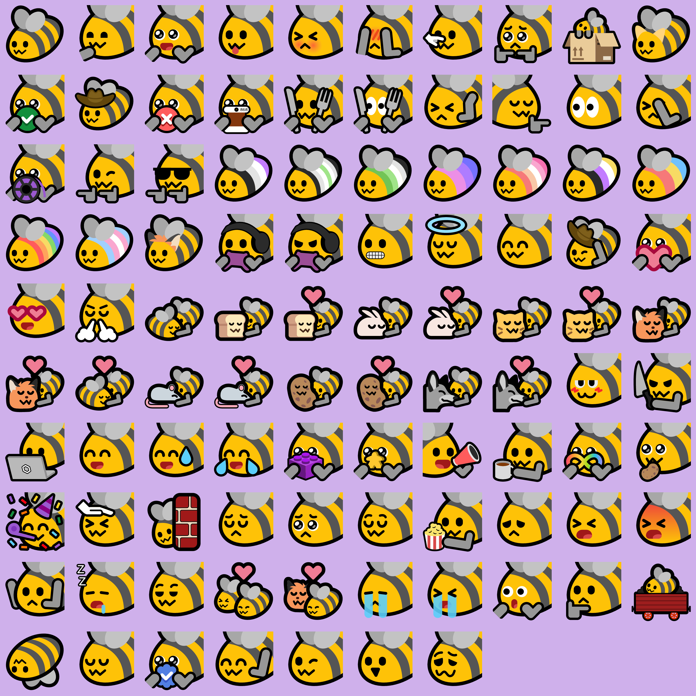
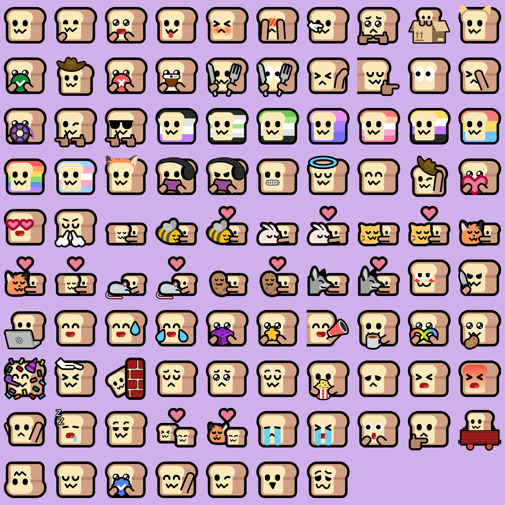
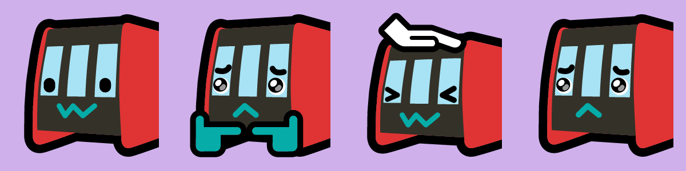
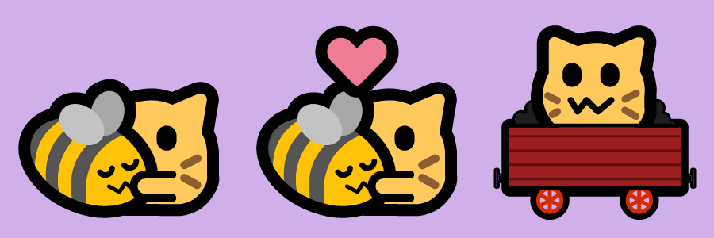
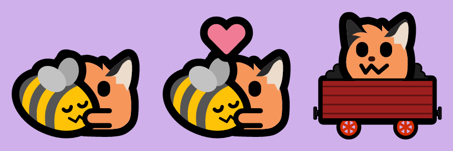

# Livmojis

This repo contains the source SVG files for all my emoji packs.

All the emojis here are licensed
[CC-BY-NC-SA](https://creativecommons.org/licenses/by-nc-sa/4.0/), and the code
in this repository is licensed under the
[MIT license](https://opensource.org/license/mit).

Neofox, Neocat, and BunHD, which are used in this repo and inspired the design
of the emojis, were all created by [Volpeon](https://volpeon.ink/emojis/).

## Emoji packs

### Blobbee

Blobbee was the first of these packs, and was originally designed to just be
pride flag bees but was then expanded to become a full set.



### Neobread

Neobread started as a single emoji, `neobread_woozy`, inspired by
[a fedi post](https://meow.woem.cat/notes/9qq5pizgf0bff23a), which I then
expanded to contain the same emojis as blobbee due to popular demand.



### NeoDLR

NeoDLR is not a full emoji set but a few very specific emojis designed to look
like
[DLR rolling stock](https://en.wikipedia.org/wiki/Docklands_Light_Railway_rolling_stock),
also inspired by [a fedi post](https://meow.woem.cat/notes/9tkftowim4l7k08p).



### Neocat

Neocat was originally created by [Volpeon](https://volpeon.ink/emojis/). These
are just a few additions I made while creating the other sets.



### Neofox

Neofox was originally created by [Volpeon](https://volpeon.ink/emojis/). These
are just a few additions I made while creating the other sets.



### Fox

Fox is based on the
[Twemoji fox face](https://commons.wikimedia.org/wiki/File:Twemoji12_1f98a.svg)
and started with `fox_plead_collar` based on
[a fedi post](https://fox.nexus/@theresnotime/112418372868714476).


## Adding to a fedi instance

A `.zip` file containing 256x256px PNGs of each emoji is available on the
[releases page](https://github.com/olivvybee/emojis/releases/latest). The
simplest (but most tedious) way to add the emojis to an instance is to download
that archive, extract it, and upload the emojis you want.

If you already have some of the emojis and just need the newer ones, each
release contains an `updates-XYZ.zip` and an `updates-XYZ.tar.gz` that contain
only the emojis changed in that release.

### Mastodon and glitch-soc

**Note: this method requires command line access to the instance. If you don't
have that, unfortunately you will need to add each emoji manually.**

Using
[Mastodon's `tootctl` CLI](https://docs.joinmastodon.org/admin/tootctl/#emoji-import)
lets you import the entire set at once from the command line.

If you trust random shell commands from the internet, run this from your
instance's `live` directory, replacing PACK_NAME with the name of the pack (e.g.
`blobbee` or `neobread`):

```
wget https://github.com/olivvybee/emojis/releases/latest/download/PACK_NAME.tar.gz
RAILS_ENV=production bin/tootctl emoji import --category PACK_NAME ./PACK_NAME.tar.gz
```

Otherwise:

1. Download the
   [latest `.tar.gz` archive](https://github.com/olivvybee/emojis/releases/latest)
   for the pack you want.
2. Run `tootctl emoji import` on the archive you downloaded.

### Misskey and its many forks (firefish, iceshrimp, sharkey, etc)

The PNG archive includes a `meta.json` that these instances can use to import
the entire archive at once.

1. Download the
   [latest `.zip` archive](https://github.com/olivvybee/emojis/releases/latest)
   for the pack you want.
2. In the custom emoji area of your instance, import the `.zip`.

The emojis will be categorised automatically.
